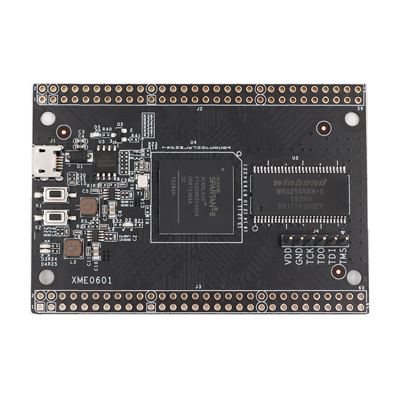

# XME0601
Contains some files for the XME0601 FPGA development board.
These files were scraped from [some Baidu link](https://pan.baidu.com/s/195nn5ujmEXeHCPsZd2hVGA).
I don't have an account for Baidu, so I was only able to get the PDFs.
If anyone can scrape the rest, please open an issue!

# Constraints
A constraints file is supplied by this repo that can be directly imported into PlanAhead.

# Common Connections
|Name|FPGA Pin|Constraint Name|
|---|---|---|
|50 MHz Clock |L30P GCLK1||clk_50mhz&
|Switch 1|L47N2|button1|
|Switch 2|L63N|button2|
|Led 1|L62P|led1|
|Led 2|L62N|led2|
